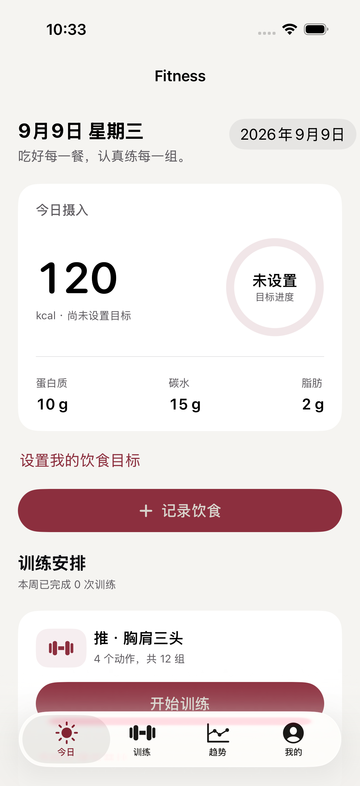
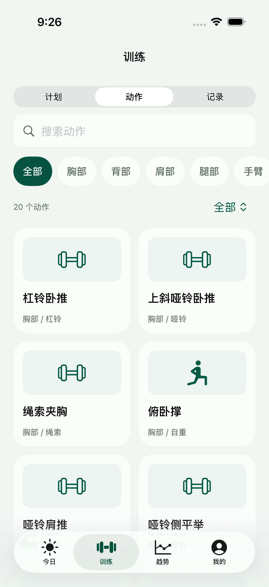
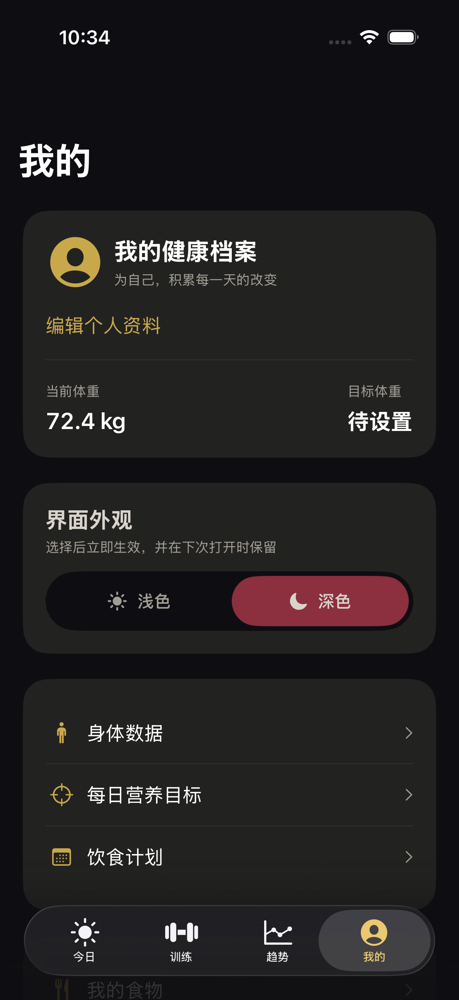

# Fitness

供个人使用的离线 iPhone 健身记录 App，支持 iOS 17 及以上。Windows 编辑源码，GitHub Actions 的 macOS/Xcode 负责编译与测试。

## 界面预览

来自 iPhone 17 Pro 模拟器。截图中的食品、摄入和体重为自动测试数据，首次使用不会预填这些数值。

  

[训练计划截图](docs/screenshots/training.png) · [营养趋势截图](docs/screenshots/trends.png)

2026-09-08 验证：19 项核心测试、2 条 iPhone 操作流程全部通过，iOS 构建成功。[查看验证记录](https://github.com/lxyxl0216/Fitness/actions/runs/34208928957)。

## 当前功能

- **今日**：热量及三大营养素、手动饮食目标、按餐次记录食物与补剂、当前餐单一键记入、训练入口及日期回看。
- **训练 / 计划**：3 个预置推/拉/腿模板；新建、编辑、排序、删除，每个动作设置逐组次数、休息与目标 RPE；1-14 天训练/休息循环。
- **训练 / 动作**：可旋转、缩放、点选的 3D 人体肌群导航；20 个常见动作按肌群、器械与名称筛选；列表加载轻量预览，详情联网播放动作 GIF，并可保存自己的 HTTPS 演示链接。
- **训练 / 记录**：重量与次数逐组输入、实际 RPE、休息倒计时、完成勾选、增删组、上次参考；自动保存，重启可继续。结束时只归档有效完成组。
- **趋势**：今日、近 7 天和近 30 天营养总量与热量图、钠数据覆盖率、本周训练次数/组数/时长、身体数据入口。
- **我的**：可选身体档案、当前/目标体重、食物与补剂标签库、饮食计划、按份数汇总采购清单及勾选、JSON 数据导出。
- **身体数据**：体重、可选体脂和腰围、测量日期；修改和删除记录，展示最近 30 条体重趋势。

首次使用：在「我的 → 我的食物」按包装营养标签添加食物，再到「今日 → 记录饮食」填写实际份数。饮食目标需要自行填写，没有预设个人数值。训练从「训练 → 计划」开始，体重从「我的 → 身体数据」记录。

界面采用灰绿背景、深绿操作按钮与分层数字排版，支持系统浅色/深色。使用系统字体、原生导航和表单，兼顾字体放大与触控。

重量统一为 kg。自重动作填 0；哑铃按单只重量记录，并始终使用相同口径。容量为已完成组的录入重量乘以次数之和，不代表运动消耗或自重动作负荷。

## 数据与限制

数据在设备的 Application Support/Fitness/fitness.json 中，以 Codable JSON 原子保存。写入成功后才更新内存；读取失败会保留原文件并提示重试，不会自动清空。兼容第一版记录，首次写入升级为版本 2。修改食物库不会改写已记录的摄入或已保存的餐单快照。无需账号或服务器。「我的 → 导出数据备份」可保存完整 JSON；尚未提供 App 内导入，卸载前请导出。

静息能量使用 [Mifflin–St Jeor 原始公式](https://pubmed.ncbi.nlm.nih.gov/2305711/)，仅在成人资料和体重齐全时估算，不将其当作饮食目标。训练容量不折算成热量。未记录日不解释为零摄入；钠统计明确显示已知数据的覆盖情况。

尚未接入身体照片、自动加重建议、AI 食谱、HealthKit、iCloud 同步、Apple Watch。3D 人体为训练部位导航示意，不作为医学模型。动作 GIF 按需从固定版本的第三方 CDN 地址读取，不下载到仓库或打包进安装包；离线或资源不可用时显示占位图。由于 [ExerciseGymGifsDB](https://github.com/JahelCuadrado/ExerciseGymGifsDB) 明确声明不拥有图片版权且不能授予授权，这项接入只适合个人评估，公开发布前需换成自有或已授权素材。完整说明见 [THIRD_PARTY_NOTICES.md](THIRD_PARTY_NOTICES.md)。

## 开发与验证

GitHub 仓库：https://github.com/lxyxl0216/Fitness

核心模型与存储位于 `Fitness/Core`，SwiftUI 页面位于 `Fitness/Views`。根目录 `Package.swift` 只编译同一份核心代码，供 macOS 执行数据与持久化测试。

在 macOS 上：

```sh
brew install xcodegen
swift test
xcodegen generate
xcodebuild -project Fitness.xcodeproj -scheme Fitness -sdk iphonesimulator -destination 'generic/platform=iOS Simulator' CODE_SIGNING_ALLOWED=NO build
```

Windows 上提交并推送到 main 后，Actions 自动执行核心测试、iOS 编译和 iPhone 模拟器 UI 测试。测试覆盖训练恢复与归档、身体数据、自建模板、食物记录与重启持久化；核心用例另外覆盖迁移、异常输入、餐单汇总、循环安排、休息计时和营养计算。`Fitness-test-results` 包含 `.xcresult`；`Fitness-screenshots` 单独提供页面截图，保留 7 天。

当前工作流构建和测试模拟器版本，没有签名、IPA 或 TestFlight 发布步骤；构建通过不等于已安装到 iPhone。
